### Название проекта
HelpDesk

### Краткое описание
Данный проект посвящен разработке приложения для регистрации и учета заявок сотрудников компании Заказчика.
Разрабатываемая информационая система должна позволить управлять уровнем предоставляемых Заказчику сервисов и в конечном итоге направлена на улучшения качества обслуживания Заказчика. 
Система должна обеспечивать следующий функционал:
- создание и хранение обращений пользователей (заявок)
- обеспечение жизненного цикла заявки от регистрации до состояния "выполнено"
- отслеживание статусов заявок
- оценка выполненных по заявке работ
- переписка в рамках заявки
- поиск по заявкам
- отчеты по количеству заявок, среднему времени выполнения, количеству просроченных заявок и т.д
- API для интеграции разрабатываемой системы с другими приложениями Заказчика (включая эндпоинты, для перспективы разработки SPA)
- автоматическое формирование документации для API

### Технологии в проекте
- Python 3.10
- Django 3.2.9
- Djangorestframework 3.13.1
- Swagger
- Redoc

### Стадия проекта
разработка MVP

### Инструкции по запуску
- Установите и активируйте виртуальное окружение
- Установите зависимости из файла requirements.txt

    >pip install -r requirements.txt

- В папке с файлом manage.py выполните команду:

    >python3 manage.py runserver

### Автор
Швейников Андрей

***
### Демонстрация работы сервиса
Для роботы с сервисом необходимо аутентифицироваться:
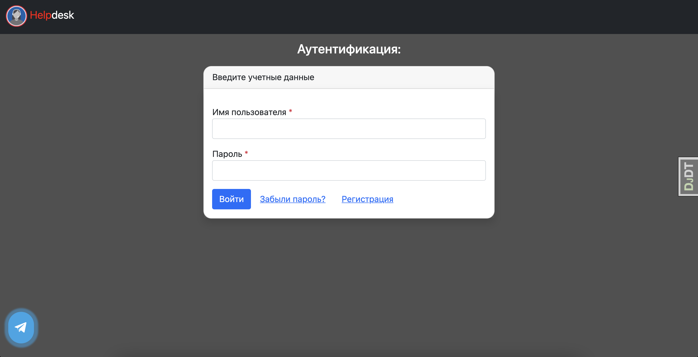
Если у Вас еще нет учетных данных, Вы можете зарегистрироваться:
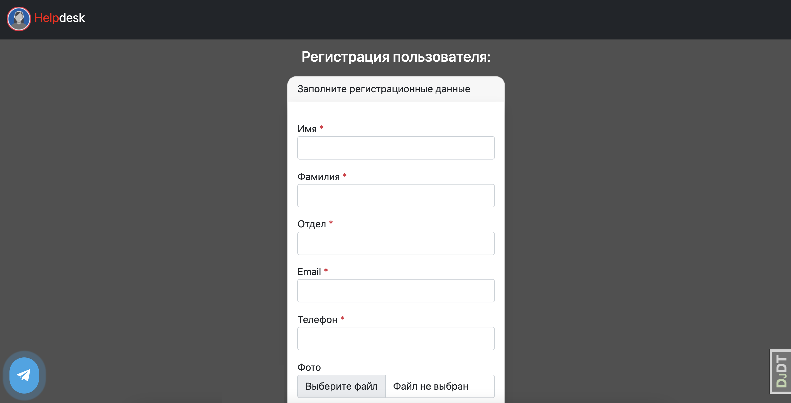
После ввода учетных данных Вы попадаете на главную страницу:

Используя панель навигации пользователь может получить страницу с созданными им заявками:
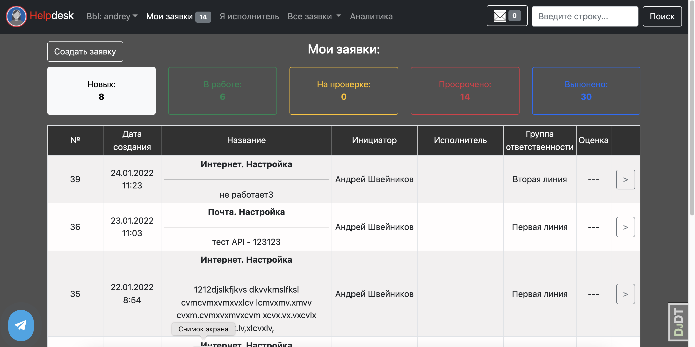
В верхней части страницы расположены фильтры с указанием количества заявок с тем или иным статусом.
При нажатии на фильтр происходит отбор заявок с выбранным статусом.
Перечень заявок при этом пагинируется.
У каждой заявки в списке можно просмотреть детализацию:
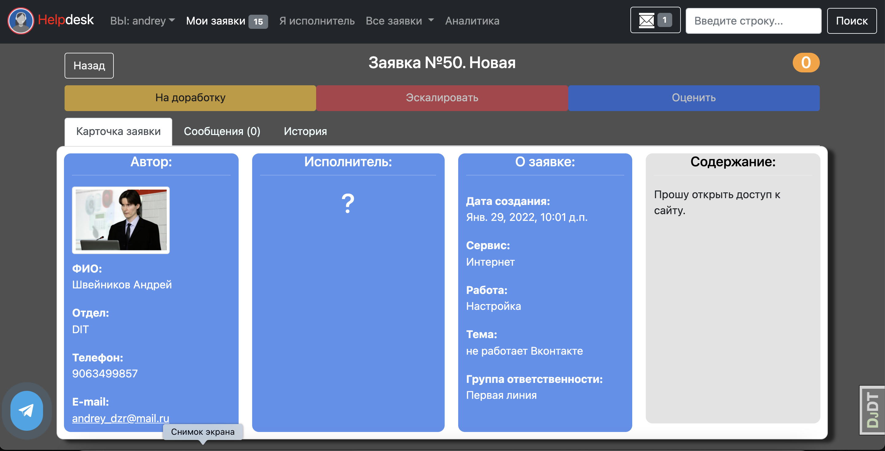
На данной страничке можно увидеть информацию о авторе заявке, исполнителе (в данном случае он еще не назначен), общую информацию о заявке.
В верхней части экрана располагается ряд кнопок для управления жизненным циклом заявки. Активность кнопок зависит от группы пользователя и статуса заявки.
Чуть ниже располагаются три вкладки:
- Карточка заявки (с основной информацией о заявке)
- Вкладка с сообщениями по заявке
- Вкладка с историей заявки

На вкладке с сообщениями можно вести переписку с службой подержки:
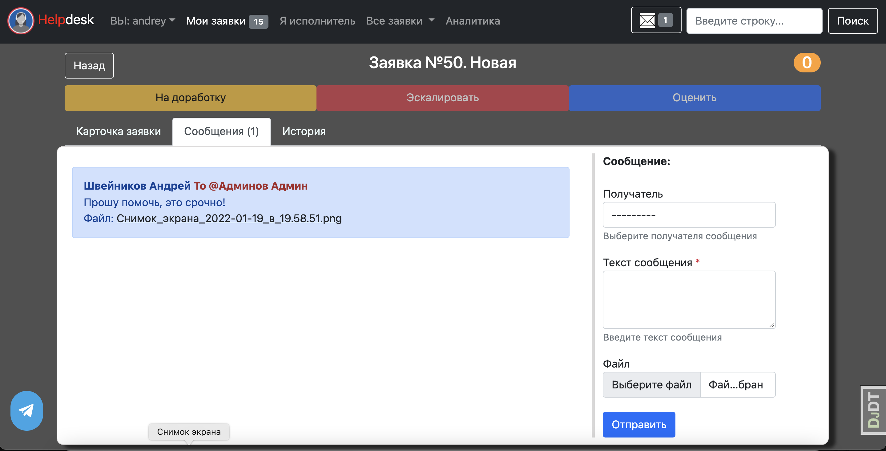

У сотрудника службы поддержки есть несколько способов работы с заявками пользователей:
### 1. Страница группы
Сервис позволяет настраивать несколько линий подержки пользователей. Одна из линий имеет статус "по умолчанию".
Созданные заявки попадают на данную линию поддержки. Сотрудник данной линии в панели навигации видит количество появившихся новых заявок.
При переходе на страницу группы сотрудник данной линии поддержки видит все заявки, попавшие в его зону ответственности. Даные заявки могут быть отфильтрованы по статусам с помощью ряда фильтров:
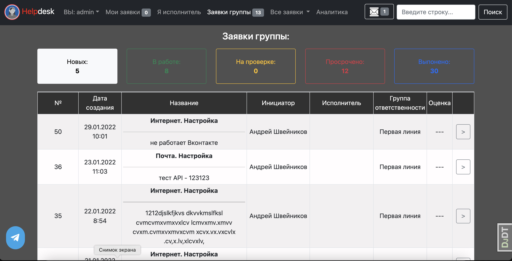
На данной странице сотрудник службы поддержки может выбрать нужную заявку, перейти к ее детализации и взять заявку в работу.
### 2. Панель уведомлений
Если пользователь написал адресное сообщение во вкладке для переписки по заявке, то у сотрудника линии поддержки в панели навигации будет указано количество новых входящих сообщений. При нажатии на кнопку с конвертом в навбаре откроется боковая панель для работы с входящими сообениями:
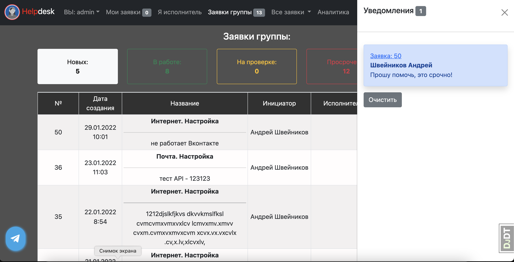
При выборе нужного сообщания сотрудник поддержки переходит к заявке, в рамках которой была инициирована переписка. Сообщение при этом переводится в состояние "прочитано" и счетчик входящих сообщений в панели навигации обнуляется:
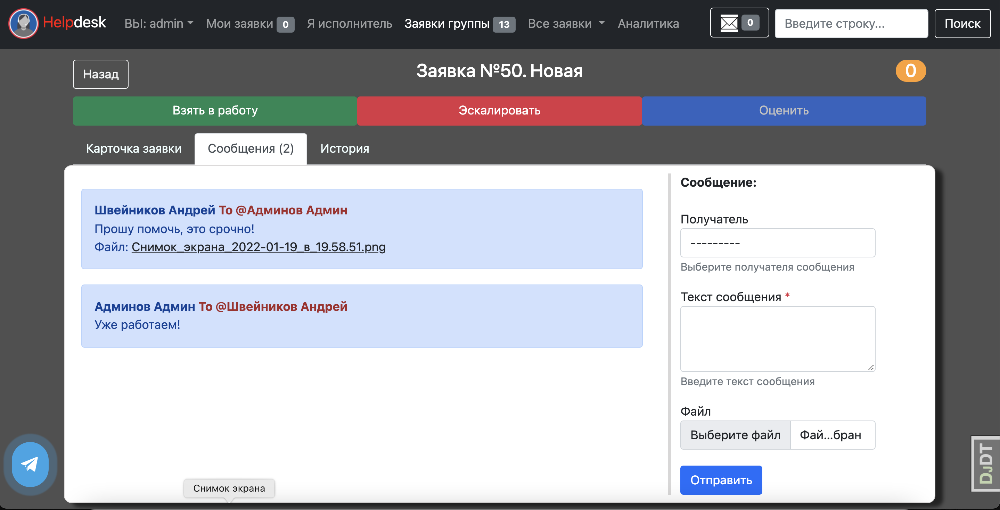
Сотрудник поддержки может ответить пользователю и взять заявку в работу с помощью ряда кнопок в верхней части страницы.
Заявка при этом изменит статус на "В работе".
После окончания работы по заявке сотрудник линии поддержки переводит заявку в состояние "на проверке", и инициатор заявки может оценить проделанную работу или вернуть заявку на доработку:
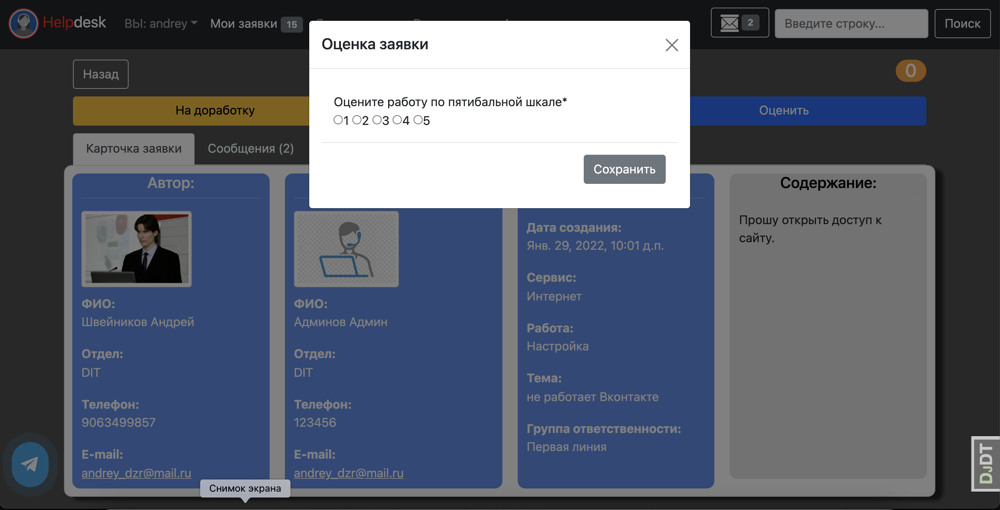
Все действия по заявке фиксируются в специальной вкладке на странице с детализацией:
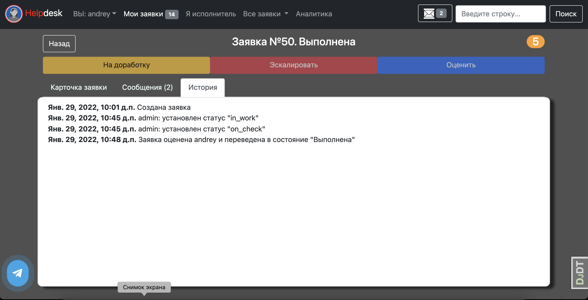

При создании заявки пользователь выбирает сервис в рамках которого требуется выполнить работу.
Перечень сервисов и работ по ним предварительно должен быть настроен. Для каждого вида работ указывается предельное время реакции линии поддержки и время выполнения работы.
Данные параметры используются для определения "просроченых заявок".
В конечном итоге для оценки работы линий поддержки может быть использована страница "Аналитика" (см навбар), на которой отображаются отчеты по количеству заявок, среднему времени выполнения, количеству просроченных заявок и т.д
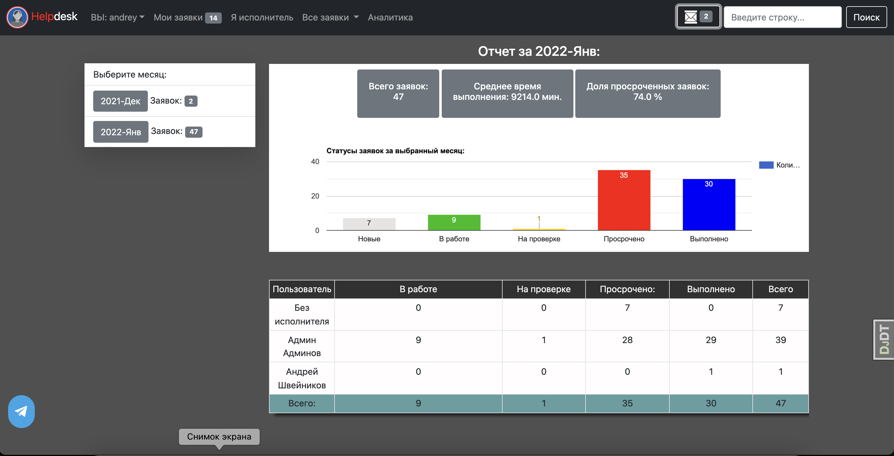

